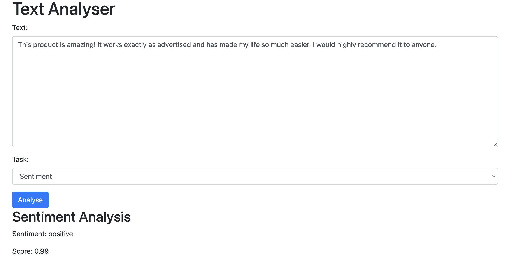
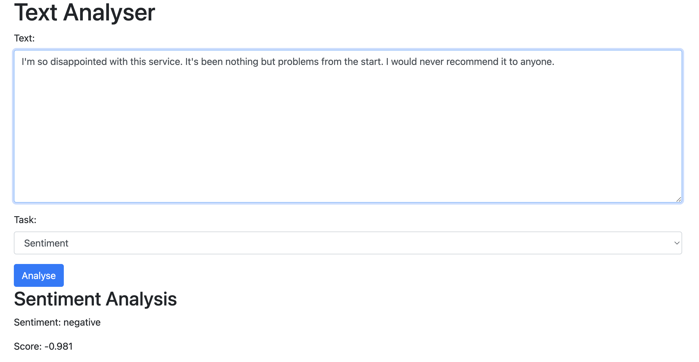
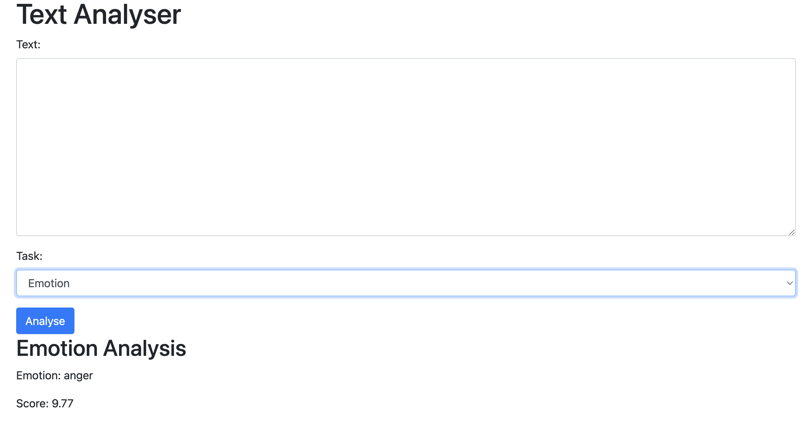
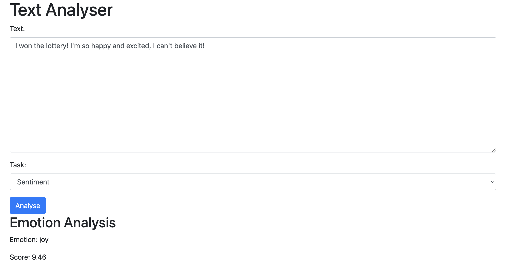
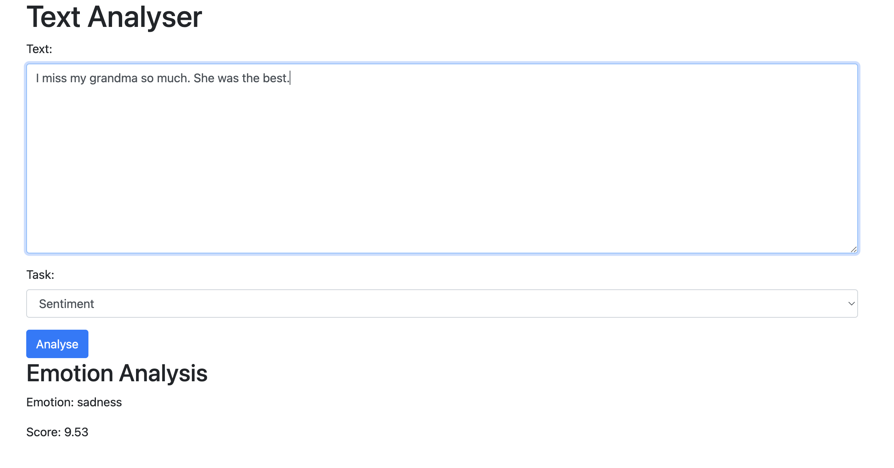
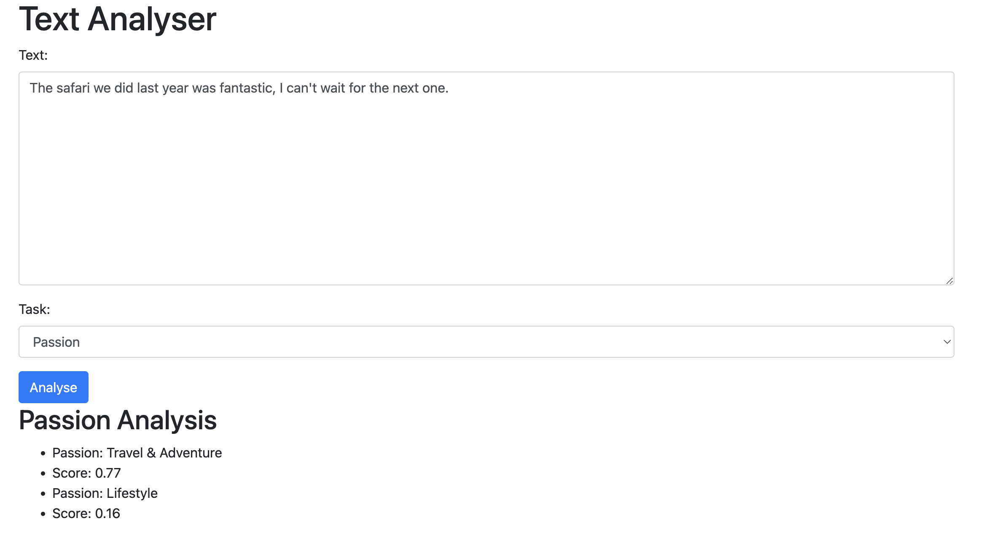

# Text Analyser
This is a simple text analysis tool that can perform various types of text analysis on a given input text. The tool supports the following types of analysis:
- Sentiment Analysis
- Emotion Analysis
- Hate Speech Analysis
- Passion Analysis
- Profanity Analysis

The tool uses a design pattern called the Strategy Pattern to select the appropriate analysis algorithm at runtime. This allows the tool to be easily extensible and maintainable.

The tool is implemented in Python and uses the Transformers library for natural language processing tasks. The tool is designed to be used as a standalone library or as part of a larger application.

## Run the code locally with Docker
### Clone the repository
```
git clone https://github.com/victorres85/text_analisys.git
```
### Build the Docker image
```
docker build -t text-analyser .
```
### Run the Docker compose file
```
docker-compose up
```
### Access the Project
```
http://localhost:8000/
```

## See the images below

### Sentiment Analysis



### Emotion Analysis




### Passion Analysis


### Hate Speech Analysis
No hate speech has been added as I am not confortable with it.
Feel free to add some and see the results.

### Profanity Analysis
No profanity has been added as I am not confortable with it.
Feel free to add some and see the results.

